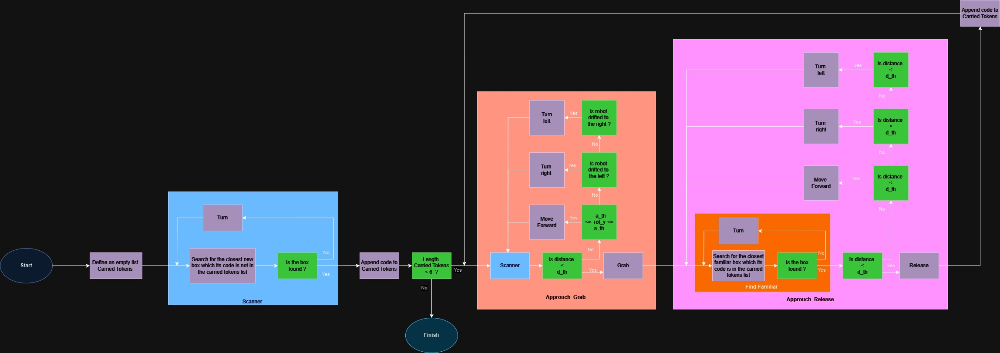

# Research_Track_I 
# Robot_Token_Gatherer 
# Assignment_I 


This Python script is designed for controlling a robot to grab tokens in an environment and then place them all together. The robot utilizes the sr.robot module for interacting with its surroundings.


## Dependencies
-Python 2.x or 3.x

-sr.robot module

## Flow Chart 


> Figure1) Flowchart of the algorithm


Initialization and Setup:

Import necessary modules and initialize the robot.
Set threshold values for orientation (a_th) and linear distance (d_th).
Create an empty list (carried_tokens) to keep track of grabbed tokens.
Drive and Turn Functions:

Implement functions (drive and turn) to control the robot's linear and angular velocities.
Scanner Function:

The scanner function scans the environment using the robot's vision (see method).
It identifies the closest token that is not in the carried_tokens list.
Returns distance, angle, and identity of the closest new token.
Find Familiar Function:

The find_familiar function scans for familiar tokens (in the carried_tokens list).
Returns the distance and angle of the closest familiar token.
Approach and Grab Function:

The approach_grab function:
Calls the scanner function to find a new token.
Drives the robot towards the new token, adjusting orientation.
Grabs the token using R.grab() once within range.
Updates carried_tokens with the new token's identity.
Approach Release Function:

The approach_release function:
Calls find_familiar to locate a familiar token in the carried_tokens list.
Drives the robot back to the familiar token, adjusting orientation.
Releases the currently held token using R.release().
Main Function:

Initializes the robot, performs an initial turn and drive.
Enters a loop until six tokens are grabbed:
Scans for a new token, grabs it, and updates the reference token.
Finds the reference token and releases the currently held token.
Updates the reference token in the carried_tokens list.
Prints a message when the robot is done working for the day.
This flowchart represents a sequence of actions where the robot continuously scans for new tokens, grabs them, and releases previously held tokens until a specified condition is met. It demonstrates a basic robotic control flow for token manipulation.
## Installing and running

The simulator requires a Python 2.7 installation, the [pygame](http://pygame.org/) library, [PyPyBox2D](https://pypi.python.org/pypi/pypybox2d/2.1-r331), and [PyYAML](https://pypi.python.org/pypi/PyYAML/).

Pygame, unfortunately, can be tricky (though [not impossible](http://askubuntu.com/q/312767)) to install in virtual environments. If you are using `pip`, you might try `pip install hg+https://bitbucket.org/pygame/pygame`, or you could use your operating system's package manager. Windows users could use [Portable Python](http://portablepython.com/). PyPyBox2D and PyYAML are more forgiving, and should install just fine using `pip` or `easy_install`.
## Exercise
To run one or more scripts in the simulator, use `run.py`, passing it the file names. 

```bash
$ python run.py exercise1.py
```
## Troubleshooting
When running `python run.py <file>`, you may be presented with an error: `ImportError: No module named 'robot'`. This may be due to a conflict between sr.tools and sr.robot. To resolve, symlink simulator/sr/robot to the location of sr.tools.

On Ubuntu, this can be accomplished by:
* Find the location of srtools: `pip show sr.tools`
* Get the location. In my case this was `/usr/local/lib/python2.7/dist-packages`
* Create symlink: `ln -s path/to/simulator/sr/robot /usr/local/lib/python2.7/dist-packages/sr/`
## The Robot API

The API for controlling a simulated robot is designed to be as similar as possible to the [SR API][sr-api].

### Motors ###

The simulated robot has two motors configured for skid steering, connected to a two-output [Motor Board](https://studentrobotics.org/docs/kit/motor_board). The left motor is connected to output `0` and the right motor to output `1`.

The Motor Board API is identical to [that of the SR API](https://studentrobotics.org/docs/programming/sr/motors/), except that motor boards cannot be addressed by serial number. So, to turn on the spot at one quarter of full power, one might write the following:

```python
R.motors[0].m0.power = 25
R.motors[0].m1.power = -25
```

### The Grabber ###

The robot is equipped with a grabber, capable of picking up a token which is in front of the robot and within 0.4 metres of the robot's centre. To pick up a token, call the `R.grab` method:

```python
success = R.grab()
```

The `R.grab` function returns `True` if a token was successfully picked up, or `False` otherwise. If the robot is already holding a token, it will throw an `AlreadyHoldingSomethingException`.

To drop the token, call the `R.release` method.

Cable-tie flails are not implemented.

### Vision ###

To help the robot find tokens and navigate, each token has markers stuck to it, as does each wall. The `R.see` method returns a list of all the markers the robot can see, as `Marker` objects. The robot can only see markers which it is facing towards.

Each `Marker` object has the following attributes:

* `info`: a `MarkerInfo` object describing the marker itself. Has the following attributes:
  * `code`: the numeric code of the marker.
  * `marker_type`: the type of object the marker is attached to (either `MARKER_TOKEN_GOLD`, `MARKER_TOKEN_SILVER` or `MARKER_ARENA`).
  * `offset`: offset of the numeric code of the marker from the lowest numbered marker of its type. For example, token number 3 has the code 43, but offset 3.
  * `size`: the size that the marker would be in the real game, for compatibility with the SR API.
* `centre`: the location of the marker in polar coordinates, as a `PolarCoord` object. Has the following attributes:
  * `length`: the distance from the centre of the robot to the object (in metres).
  * `rot_y`: rotation about the Y axis in degrees.
* `dist`: an alias for `centre.length`
* `res`: the value of the `res` parameter of `R.see`, for compatibility with the SR API.
* `rot_y`: an alias for `centre.rot_y`
* `timestamp`: the time at which the marker was seen (when `R.see` was called).

For example, the following code lists all of the markers the robot can see:

```python
markers = R.see()
print "I can see", len(markers), "markers:"

for m in markers:
    if m.info.marker_type in (MARKER_TOKEN_GOLD, MARKER_TOKEN_SILVER):
        print " - Token {0} is {1} metres away".format( m.info.offset, m.dist )
    elif m.info.marker_type == MARKER_ARENA:
        print " - Arena marker {0} is {1} metres away".format( m.info.offset, m.dist )
```

[sr-api]: https://studentrobotics.org/docs/programming/sr/

## Functions

1. drive(speed, seconds)
Sets a linear velocity for the robot.

speed (int): The speed of the wheels.
seconds (int): The time interval for the motion.

def drive(speed, seconds):
    
    R.motors[0].m0.power = speed
    R.motors[0].m1.power = speed
    time.sleep(seconds)
    R.motors[0].m0.power = 0
    R.motors[0].m1.power = 0


2. turn(speed, seconds)
Sets an angular velocity for the robot.

speed (int): The speed of the wheels.
seconds (int): The time interval for the motion.

def turn(speed, seconds):
    R.motors[0].m0.power = speed
    R.motors[0].m1.power = -speed
    time.sleep(seconds)
    R.motors[0].m0.power = 0
    R.motors[0].m1.power = 0


3. scanner()
Scans the environment to find the closest new tokens whose codes do not belong to the carried_tokens list.

Returns:

dist (float): Distance of the closest new token (-1 if no new code token is detected from outside the carried_tokens list).
rot_y (float): Angle between the robot and the new token (-1 if no new code token is detected).
identity (int): The code of the closest new token (-1 if no new code token is detected).

def scanner():

 dist=100
 
 for token in R.see():
  if token.dist < dist and token.info.code not in carried_tokens:
    dist = token.dist 
    rot_y= token.rot_y
    identity= token.info.code 
   
 if dist == 100 : 
  return -1 , -1 ,-1
 else :
  return dist , rot_y , identity 

  
4. find_familiar()
Scans the environment to find the closest familiar tokens whose codes are in the carried_tokens list.

Returns:

dist (float): Distance of the closest familiar token (-1 if no familiar token is detected from the carried_tokens list).
rot_y (float): Angle between the robot and the familiar token (-1 if no familiar token is detected).

def find_familiar():

    dist = 100
    for token in R.see():
        if token.dist < dist and token.info.code in carried_tokens:
            dist = token.dist
            rot_y = token.rot_y

    if dist == 100:
        return -1, -1
    else:
        return dist, rot_y


5. approach_grab()
Approaches and drives the robot towards the closest new token to grab it.

Returns:

identity (int): The code of the closest token so the carried_tokens list stays updated.

def approach_grab():
         
	 ready= 1
	 " scanning for new boxes and trying to obtain their info"
	 dist, rot_y, identity = scanner() 
	 
	 while dist == -1 :
	  print (" i couldnt find a new target !")
	  print (" searching for a new target")
	  
	  turn (20,1)
	  dist , rot_y , identity = scanner()
	  
	 print(" oh I found a new one !")
	 while  dist > d_th  :
	    
	      if ready == 1:
		  drive (30,1) 
		  ready =0 
		  dist, rot_y , identity =scanner()
		  
	      elif - a_th <= rot_y <= a_th :
		  dist, rot_y , identity  = scanner()
		  drive(20,0.5)
		  ready=0
	      elif rot_y > a_th :
		   turn(2,1)
		   dist, rot_y , identity  = scanner()
		   
		   ready=1
	      elif rot_y < - a_th :
		   turn(-2,1)
		   dist, rot_y , identity  = scanner()
		   ready=1
	 print(" I should be able to grab it") 		       
	 R.grab() 
	 print("ITS HEAVY !!")
	 return identity 


6. approach_release()
Drives the robot back towards the closest familiar token to release the currently held token next to it.

def approach_release():

 ready=1
 " scanning for box with a familiar tokens and obtaining its orientation"
 print(" where did I put that box !?")
 dist, rot_y = find_familiar()
 
 while dist == -1 :
  print (" I couldnt remember !")
  print (" searching again.....")
  
  turn (20,0.5)
  dist , rot_y  = find_familiar()
  
 print(" I remember how to go back") 
 while  dist > d_th + 0.3  :
    
      if ready == 1:
          drive (30,1) 
          ready =0 
          dist, rot_y  = find_familiar()
          
      elif - a_th <= rot_y <= a_th :
          dist, rot_y  = find_familiar()
          drive(20,0.5)
          ready=0
      elif rot_y > a_th :
           turn(2,1)
           dist, rot_y   = find_familiar()
           
           ready=1
      elif rot_y < - a_th :
           turn(-2,1)
           dist, rot_y   = find_familiar()
           ready=1
 print("FINALLY I CAN DROP IT")
 R.release()
 print(" the box has been dropped successfully")
 drive(-30,1)


7. main()
The main function orchestrating the workflow of the robot to grab and release tokens next to each other.

def main():
        
    print(" LETS START !")  
	turn( 7,2)
	drive(10,2)

	dist, rot_y, identity = scanner()
	print("curruntly held tokens : ",carried_tokens)
	
	carried_tokens.append(identity) 
	print("update carried_tokens :",carried_tokens)
	
	while len ( carried_tokens ) < 6 :
	 
	 identity = approach_grab()  	 

	 approach_release() 
        
    print(" I am done working for today !!! ")
	exit()

main()	
	  
